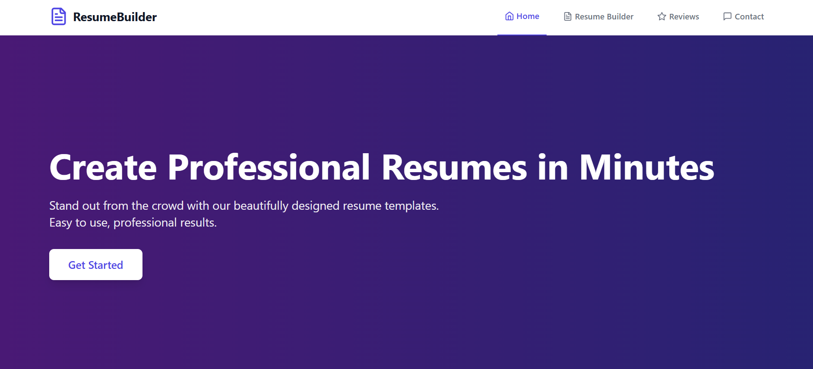
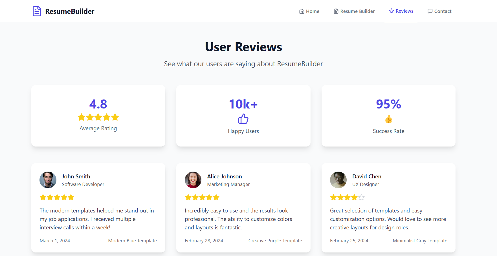

# Resume Builder Website

## 📌 Overview
A **Resume Builder Website** that allows users to create, customize, and preview resumes with ease. The platform provides multiple templates and a user-friendly interface for seamless resume creation.

## 🚀 Features
- 📝 **Resume Form**: Users can input their details, including name, experience, skills, education, and more.
- 👀 **Live Preview**: See real-time updates as you fill out the resume form.
- 🎨 **Template Selection**: Choose from multiple resume templates.
- 🎭 **Dark/Light Mode**: Toggle between different themes.
- 📂 **Download & Print**: Export resumes in **PDF** format.
- 💾 **Auto Save**: Saves resume progress automatically.
- 📱 **Fully Responsive**: Works on desktop, tablet, and mobile.
- 🌍 **Multi-Language Support** (Planned).

## 🏗️ Components
### 📜 Navbar (`Navbar.jsx` `)
- Displays navigation links.
- Responsive design.

### 📝 Resume Form (`ResumeForm.jsx` )
- Contains input fields for personal details, work experience, and education.
- Validates user input.

### 👀 Resume Preview (` ResumePreview.jsx`)
- Displays resume in real-time as users input data.
- Changes dynamically based on selected template.

### 🎨 Template Selector (`TemplateSelector.jsx`)
- Allows users to switch between resume templates.
- Updates the preview instantly.

## 🖼️ Icons & Images
- **Icons**: Using [React Icons](https://react-icons.github.io/react-icons/) for UI elements.
- **Images**: Hosted locally or fetched from an external source (Unsplash, etc.).

## 🖼️ Website Images

 

  

## 🛠️ Tech Stack
- **Frontend**: React.js, Tailwind CSS
- **Backend (Planned)**: Node.js, Express
- **Database (Planned)**: MongoDB for saving resume data

## 📝 Future Enhancements
- ✨ AI-powered resume suggestions.
- 📩 Direct email sending feature.
- 🔄 Integration with job portals.
- 🌐 Cloud-based resume storage.

## 📬 Contact
For feedback or issues, reach out at **https://github.com/aditya-raulji** or create an issue on GitHub!

---
💡 *Built with ❤️ using React.js & Tailwind CSS!*
